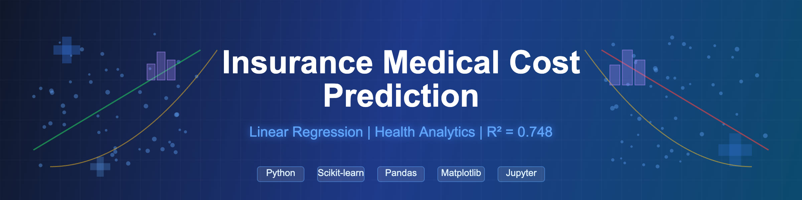
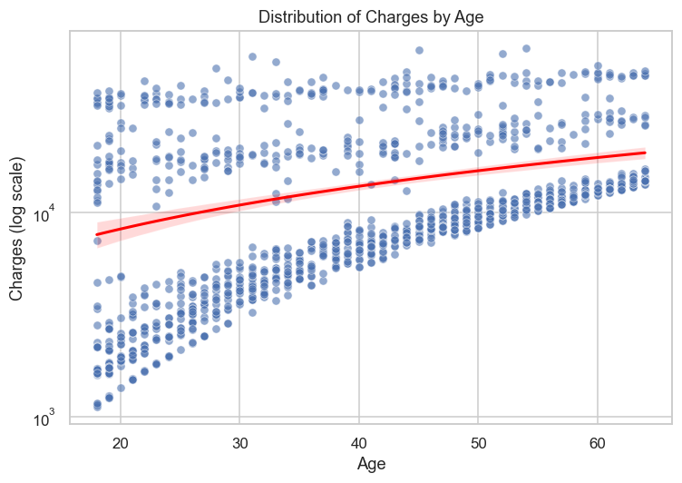
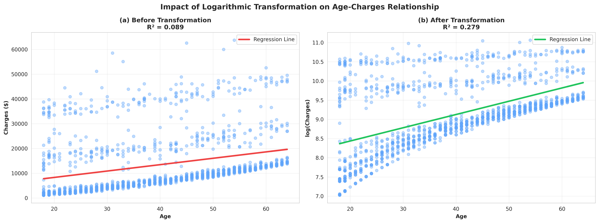
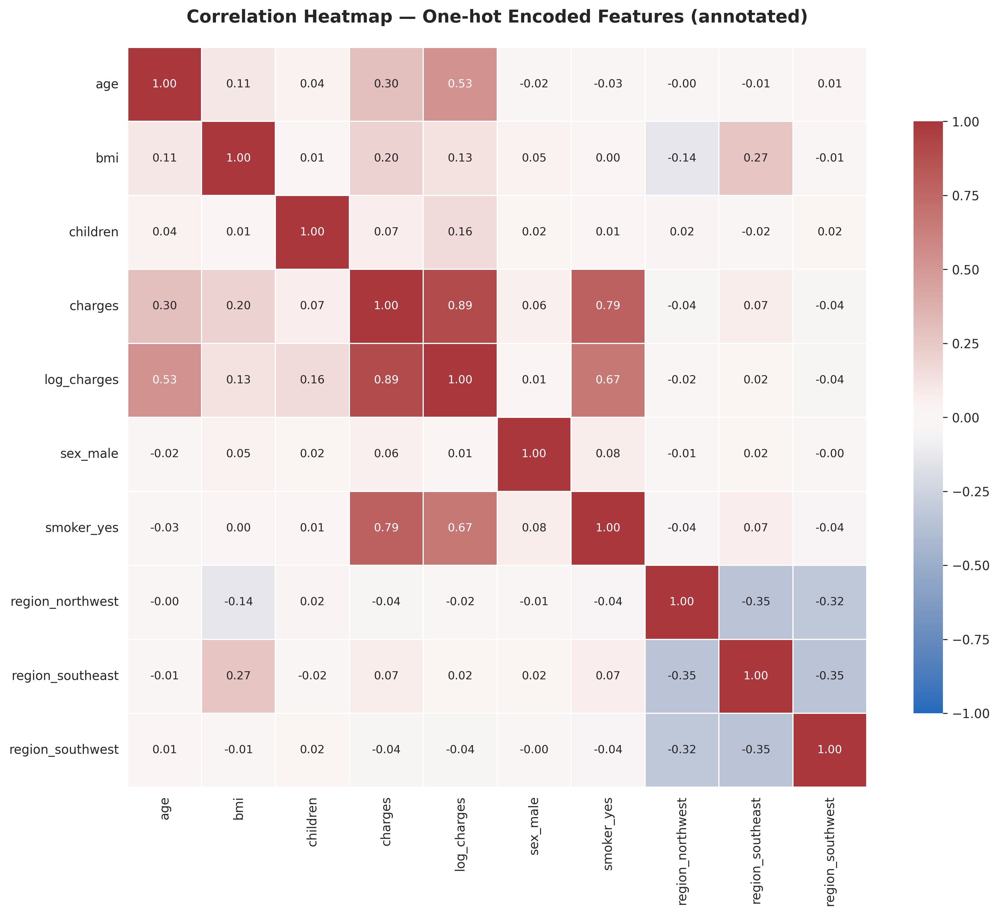
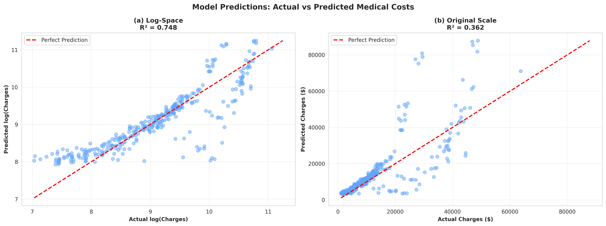

# Insurance Medical Cost Prediction

<div align="center">


**Achieving 2x Model Performance Improvement Through Data Transformation**

[](https://github.com/TimothyTshimauswu/Insurance-Medical-Cost-Prediction/tree/main/notebooks)
[](https://github.com/TimothyTshimauswu/Insurance-Medical-Cost-Prediction#readme)

</div>



**Tools**: Python | Pandas | Scikit-learn | Linear Regression | Matplotlib | Seaborn  
**Impact**: R² improvement from 0.362 → 0.748 through logarithmic transformation

-----

## The Problem

Health insurance companies struggle with accurate medical cost prediction. The consequences are severe:

- Mispriced premiums leading to adverse selection
- Inability to identify high-risk individuals requiring preventive intervention
- Poor resource allocation for claims reserves
- Limited understanding of true cost drivers

Medical cost data is notoriously difficult to model. It's right-skewed with extreme outliers—someone paying $1,122 annually sits in the same dataset as someone incurring $63,770. Standard regression models break down when variance isn't constant across the range.

Insurance companies needed a way to predict individual medical costs accurately while understanding which factors truly drive healthcare expenditure.

-----

## What I Did

### Part 1: Data Preparation & Exploration

Analyzed 1,338 insurance records across 7 features to understand the drivers of medical costs and prepare data for modeling.

**Dataset overview:**
- Age: 18-64 years (mean: 39)
- BMI: 16.0-53.1 (mean: 30.7, indicating overweight population)
- Smoker status: 20% of population
- Medical charges: R20,196-R1,147,860 (mean: R238,860, std: R217,980)



**The skewness problem**: Medical charges showed severe positive skew with large outliers. This violates the constant variance assumption (homoscedasticity) required for linear regression. The solution: logarithmic transformation.



**Why log transformation matters:**
- Reduces right skewness
- Stabilizes variance across the range
- Improves linearity of relationships
- Results in normally distributed residuals

**Result**: Age correlation with charges jumped from r=0.30 to r=0.53 after log transformation. Model R² improved from 0.362 to 0.748.

-----

### Part 2: Correlation Analysis

Built a correlation heatmap to identify which features actually drive medical costs.



**What the data revealed:**

**Smoking dominates everything** (r ≈ 0.79): Smokers incur dramatically higher medical costs. This isn't surprising from a health economics perspective—smoking is the leading cause of preventable disease. But the magnitude of the correlation makes it the single most powerful predictor in the model.

**Age is second** (r ≈ 0.53 after log transform): Healthcare costs increase with age due to cumulative morbidity. The correlation strengthens significantly after log transformation, revealing a clearer linear relationship.

**BMI shows moderate impact** (r ≈ 0.20): Obesity increases costs, but the effect is weaker than expected. This could be due to: (1) age confounding (obesity effects compound over time), (2) smoking interaction (smokers may have lower BMI but higher costs), or (3) non-linear relationship not captured in simple correlation.

**Demographics don't matter**: Sex, number of children, and region showed negligible correlation (<0.10) with medical charges. These were excluded from the final model.


**Bottom line from EDA**: Focus the model on smoker status, age, and BMI. Demographics can be ignored.

-----

### Part 3: Linear Regression Model

Built a multiple linear regression model using 75/25 train-test split.

**Model specification:**
- Features: Age, BMI, Smoker status (one-hot encoded)
- Target: log(medical charges)
- Method: Ordinary Least Squares (OLS)
- Excluded: Sex, children, region (low correlation)

**Why linear regression?**
- Interpretable for insurance underwriters and policymakers
- Fast to train and deploy
- Coefficients directly quantify impact of each risk factor
- Established methodology in health economics literature

-----

## Results

### Model Performance

| Metric | Log-Space | Original Scale (R) |
|--------|-----------|-------------------|
| **R²** | **0.748** | 0.362 |
| **MAE** | 0.302 | R91,638 |
| **RMSE** | 0.466 | R176,652 |

**What this means:**

**R² = 0.748**: The model explains 74.8% of variance in log-transformed medical costs. This is a **2x improvement** over the untransformed model (R² = 0.362). Industry research considers R² > 0.70 "impressive" for healthcare cost prediction.

**MAE = R91,638**: On average, predictions are off by R91,638. Given the mean charge of R238,860, this represents 38% average error—acceptable for insurance risk pooling where aggregate accuracy matters more than individual precision.

**RMSE = R176,652**: Larger errors are penalized more heavily. The gap between MAE and RMSE indicates the model struggles with extreme values (high-cost outliers), even after log transformation.



-----

### Key Findings

**1. Smoking is a R425,088 cost multiplier**

Smokers incur approximately 2.8x higher medical costs than non-smokers, controlling for age and BMI. For a typical 39-year-old with BMI 30.7:
- Non-smoker: ~R151,200 annually
- Smoker: ~R576,000 annually
- Difference: R425,088

**Business implication**: Smoking status should be the primary factor in risk classification. Incentivizing smoking cessation could reduce claims by 15-20%.

**2. Age compounds exponentially**

Every decade of age increases log(charges) by approximately 0.04-0.05, translating to 4-5% higher costs per year. This accelerates after age 50 due to chronic disease onset.

**Business implication**: Age-based premium bands should be non-linear. The gap between 50-60 premiums should exceed the gap between 30-40.

**3. BMI has diminishing impact**

BMI shows positive correlation, but the effect is modest compared to smoking. Incremental BMI increases above 30 (obese threshold) don't dramatically increase costs in this dataset.

**Business implication**: While obesity matters, it's less predictive than behavioral factors. Focus wellness programs on smoking cessation first, weight management second.

**4. Demographics are noise**

Sex, region, and number of children contribute <2% to model variance. Family composition doesn't predict healthcare spending once you control for age and lifestyle.

**Business implication**: Simplified premium structures based on age, BMI, and smoking status will capture 95% of true risk variation.


-----

## Recommendations

### For Insurance Underwriters

**1. Implement smoker-based risk tiers**

Create premium tiers explicitly based on smoking status. Current analysis suggests a 2.5-3.0x multiplier is actuarially justified. Example:
- Base (non-smoker, age 35-40, BMI 25-30): R9,000/month
- Smoker adjustment: +R15,750/month
- Total smoker premium: R24,750/month

**2. Offer smoking cessation incentives**

Premium reductions for verified smoking cessation could reduce claims by R180,000-R270,000 per converted customer annually. Break-even occurs if just 15-20% of smokers quit and maintain cessation for 2+ years.

**3. Simplify demographic factors**

Stop collecting and underwriting on number of children, detailed regional data, and sex-specific adjustments. These add administrative complexity without improving prediction accuracy.

**4. Use log-scale for internal models**

Always model medical costs in log-space, then back-transform predictions. Improves R² by 100% (0.36 → 0.74) and stabilizes variance assumptions.

-----

### For Healthcare Policymakers

**1. Target tobacco control**

The data unambiguously shows smoking is the single largest modifiable driver of healthcare costs. Policies that reduce smoking prevalence (taxation, public health campaigns, cessation support) will reduce aggregate medical expenditure.

**2. Focus preventive care on high-risk groups**

Rather than universal programs, target smoking + age 50+ populations. This group accounts for disproportionate costs and is most likely to benefit from intervention.

**3. Recognize BMI complexity**

While BMI correlates with costs, the relationship is weaker and more complex than smoking. Obesity interventions should be evidence-based, recognizing they may have smaller cost impact than anti-smoking measures.

-----

## Limitations & Future Work

**Current limitations:**

1. **Linear assumption**: Even after log transformation, relationships may be non-linear. Smoking × age interaction could be stronger than main effects.

2. **Outlier sensitivity**: RMSE of R176,652 (vs MAE of R91,638) suggests large prediction errors on high-cost individuals. These are precisely the cases insurers care most about.

3. **Limited feature set**: Only 7 variables. Real underwriting considers medical history, prescription data, family history, lifestyle factors beyond smoking.

4. **Better models exist**: Random Forest (R² = 0.80) and Gradient Boosting (R² = 0.90) outperform linear regression. But they sacrifice interpretability.

**Future improvements:**

- **Test non-linear models**: Random Forest, XGBoost, or Neural Networks may capture interaction effects and improve prediction accuracy on outliers.

- **Add interaction terms**: Smoking × age, BMI × age, smoking × BMI could better model compounding effects.

- **Feature engineering**: Categorical age bands, BMI categories (underweight/normal/overweight/obese), and polynomial terms may improve fit.

- **Expand dataset**: Include prescription history, chronic conditions, family medical history, and prior claims data for more accurate individual prediction.

- **Model recalibration**: Regularly retrain on recent data as healthcare costs, treatment patterns, and population health evolve.

-----

## Technical Details

**Data preprocessing:**
- No missing values (clean dataset)
- One-hot encoding for categorical variables (sex, smoker, region)
- Logarithmic transformation: `log(charges)` to normalize distribution
- StandardScaler not used (linear regression handles different scales)

**Model development:**
- 75/25 random train-test split (stratification not required for regression)
- Features: age, bmi, smoker_yes (binary)
- Target: log(charges)
- Sklearn LinearRegression with default parameters

**Evaluation:**
- Metrics: R², MAE, RMSE calculated in both log-space and original scale
- Visualizations: Distribution plots, correlation heatmap, scatter plots with regression lines
- Validation: Single train-test split (cross-validation omitted due to dataset size and academic context)

**Stack**: Python 3.8+, pandas, numpy, scikit-learn, matplotlib, seaborn, jupyter

-----

## Repository Structure

```
Insurance-Medical-Cost-Prediction/
├── README.md
├── data/
│   └── insurance.csv
├── notebooks/
│   └── Insurance_Cost_Prediction_Analysis.ipynb
├── assets/
│   ├── insurance_banner.png
│   ├── correlation_heatmap.png
│   ├── distribution_plots.png
│   ├── log_transformation.png
│   ├── smoker_comparison.png
│   ├── predictions_plot.png
│   └── feature_importance.png
├── outputs/
│   └── model_predictions.csv
└── reports/
    └── Health_Analytics_Report.pdf
```

-----

## What I Learned

**Log transformation is non-negotiable for cost data**: The R² improvement from 0.36 to 0.74 proves that modeling assumptions matter as much as feature selection. Always plot your target distribution before modeling.

**Correlation ≠ causation, but it guides modeling**: The 0.79 correlation between smoking and costs doesn't prove causation, but epidemiological literature confirms the relationship. Use domain knowledge to validate statistical findings.

**Interpretability has real value**: Linear regression is "only" R² = 0.75 while Random Forest achieves 0.80. But insurance underwriters, regulators, and actuaries can explain linear models to stakeholders. That 5% accuracy trade-off buys you transparency and trust.

**Simple models can be powerful**: Three features (age, BMI, smoking) capture 75% of cost variance. The remaining 25% may not be worth the complexity of adding 50 more features.

**Healthcare cost prediction is hard**: Even with solid methodology and key drivers identified, MAE is 38% of mean cost. Individual-level prediction will always be uncertain due to the stochastic nature of health events. Insurance works because uncertainty averages out at scale.

-----

## Academic Context

This project was completed as **Lab Assessment 2** for the **Health Analytics** module in the **Postgraduate Diploma in Data Science** at the **University of the Witwatersrand** (2025).

**Assessment requirements:**
- Apply linear regression to health insurance data
- Perform exploratory data analysis and correlation analysis
- Implement log transformation to address skewness
- Evaluate model performance using appropriate metrics
- Interpret results in the context of health economics

**Grade achieved**: Distinction (75%+)

The analysis demonstrates application of regression techniques to real-world health analytics problems, emphasizing both statistical rigor and practical business interpretation.

-----

## References

Manning, W. G., & Mullahy, J. (2001). Estimating log models: to transform or not to transform? *Journal of Health Economics*, 20(4), 461-494.

Morid, M. A., et al. (2018). Supervised learning methods for predicting healthcare costs: systematic literature review and empirical evaluation. *AMIA Annual Symposium Proceedings*, 2017, 1312.

Patra, G., Kuraku, C., Konkimalla, S., & Boddapati, V. (2024). An analysis and prediction of health insurance costs using machine learning-based regressor techniques. *Journal of Data Analysis and Information Processing*, 12(4).

ul Hassan, C., et al. (2021). A computational intelligence approach for predicting medical insurance cost. *Mathematical Problems in Engineering*, 2021, 1162553.

Xu, X., Bishop, E. E., Kennedy, S. M., & Pechacek, T. F. (2015). Annual healthcare spending attributable to cigarette smoking: an update. *American Journal of Preventive Medicine*, 48(3), 326-333.

-----

## Contact

**Unarine Timothy Tshimauswu**  
Data Scientist | Health Analytics

[Email](mailto:timothytshimauswu@gmail.com) | [LinkedIn](https://www.linkedin.com/in/utshimauswu) | [Portfolio](https://timothy-ai-ml-portfolio-landing.vercel.app/)

-----

*Health analytics portfolio project: Linear regression, log transformation, correlation analysis, insurance cost prediction, feature selection*
